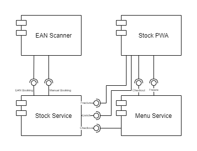
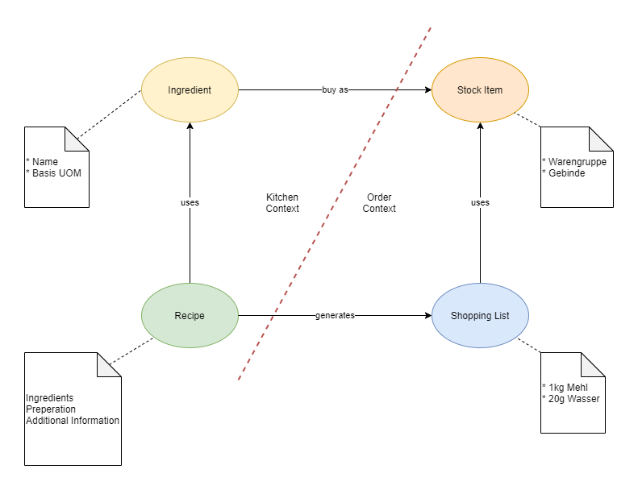

# foodlr-service
This repository contains all lambda functions for the serverless foodlr backend. It consists of a stock service for managing your local stock like barcode/manual import, fracture, enrichment and checkout and a menu service for managing your recipes, generating shopping lists, checkout, freeze and so on.

The services are intended to help you generate weekly shopping lists with ease and keep track of your local stock as well as present those recipes for others.

## Other Componentes
* [foodlr-cli](https://github.com/mvlasaty23/foodlr-cli)
* [foodlr-scanner (for android)](https://github.com/mvlasaty23/stock-scanner-native)
* [foodlr-pwa (TBD)]()

## Architecture
### Component View


### Logical View


## Development
This project has been generated using the `aws-nodejs-typescript` template from the [Serverless framework](https://www.serverless.com/).

For detailed instructions, please refer to the [documentation](https://www.serverless.com/framework/docs/providers/aws/).

## Installation/deployment instructions

Depending on your preferred package manager, follow the instructions below to deploy your project.

> **Requirements**: NodeJS `lts/fermium (v.14.15.0)`. If you're using [nvm](https://github.com/nvm-sh/nvm), run `nvm use` to ensure you're using the same Node version in local and in your lambda's runtime.

### Using Yarn

- Run `yarn` to install the project dependencies
- Run `yarn sls deploy` to deploy this stack to AWS

## Test your service

### Locally

In order to test the hello function locally, run the following command:

- `yarn sls invoke local -f hello --path src/functions/hello/mock.json`

Check the [sls invoke local command documentation](https://www.serverless.com/framework/docs/providers/aws/cli-reference/invoke-local/) for more information.

### Remotely

Copy and replace your `url` - found in Serverless `deploy` command output - and `name` parameter in the following `curl` command in your terminal or in Postman to test your newly deployed application.

```
curl --location --request POST 'https://myApiEndpoint/dev/hello' \
--header 'Content-Type: application/json' \
--data-raw '{
    "name": "Frederic"
}'
```

## Template features

### Project structure

The project code base is mainly located within the `src` folder. This folder is divided in:

- `functions` - containing code base and configuration for your lambda functions
- `libs` - containing shared code base between your lambdas

```
.
├── src
│   ├── functions               # Lambda configuration and source code folder
│   │   ├── hello
│   │   │   ├── handler.ts      # `Hello` lambda source code
│   │   │   ├── index.ts        # `Hello` lambda Serverless configuration
│   │   │   ├── mock.json       # `Hello` lambda input parameter, if any, for local invocation
│   │   │   └── schema.ts       # `Hello` lambda input event JSON-Schema
│   │   │
│   │   └── index.ts            # Import/export of all lambda configurations
│   │
│   └── libs                    # Lambda shared code
│       └── apiGateway.ts       # API Gateway specific helpers
│       └── handlerResolver.ts  # Sharable library for resolving lambda handlers
│       └── lambda.ts           # Lambda middleware
│
├── package.json
├── serverless.ts               # Serverless service file
├── tsconfig.json               # Typescript compiler configuration
├── tsconfig.paths.json         # Typescript paths
└── webpack.config.js           # Webpack configuration
```

### 3rd party libraries

- [json-schema-to-ts](https://github.com/ThomasAribart/json-schema-to-ts) - uses JSON-Schema definitions used by API Gateway for HTTP request validation to statically generate TypeScript types in your lambda's handler code base
- [middy](https://github.com/middyjs/middy) - middleware engine for Node.Js lambda. This template uses [http-json-body-parser](https://github.com/middyjs/middy/tree/master/packages/http-json-body-parser) to convert API Gateway `event.body` property, originally passed as a stringified JSON, to its corresponding parsed object
- [@serverless/typescript](https://github.com/serverless/typescript) - provides up-to-date TypeScript definitions for your `serverless.ts` service file
